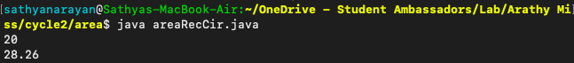
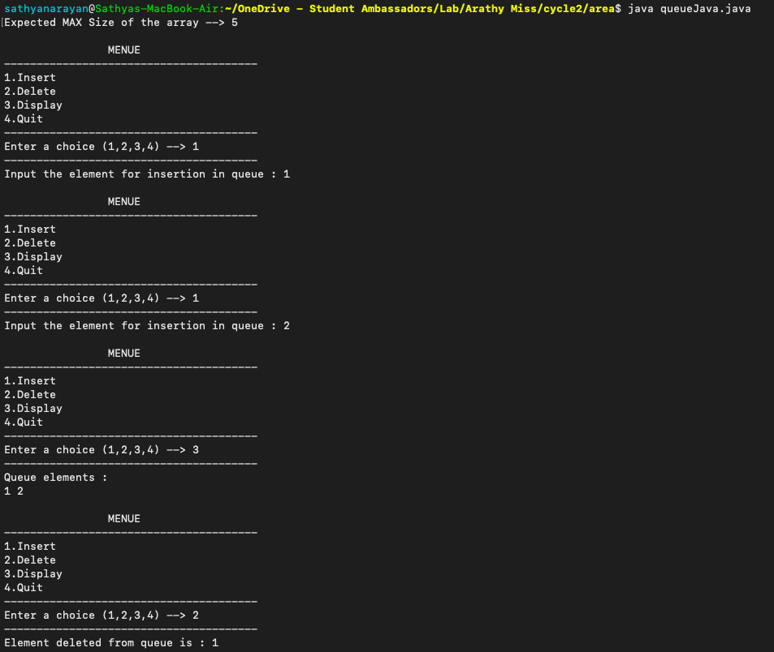
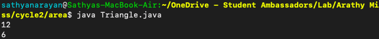
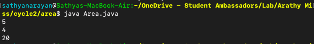
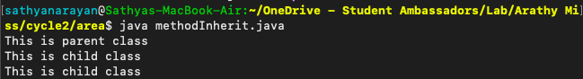

# Lab Cycle 2
## Questions
1. Write a Java class having overloaded methods to calculate area of rectangle and circle.
   
   
2. Define a class Queue for representing a queue data structure. The class must
define a default constructor, a parameterized constructor and functions for en-
queue, de-queue and display operations. Write a Java program to implement
this.

    

3. Write a program to print the area and perimeter of a triangle having sides of 3, 4 and 5 units by creating
a class named 'Triangle' without any parameter in its constructor.

    
4. Write a program to print the area of a rectangle by creating a class named 'Area' taking the values of its
length and breadth as parameters of its constructor and having a method named 'returnArea' which returns
the area of the rectangle. Length and breadth of rectangle are entered through keyboard.

    
5. Create a class with a method that prints "This is parent class" and its subclass with another method that
prints "This is child class". Now, create an object for each of the class and call
- method of parent class by object of parent class
- method of child class by object of child class
- method of parent class by object of child class

    

    ----------
    
 
